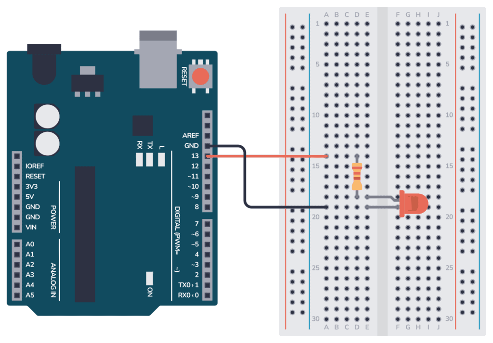
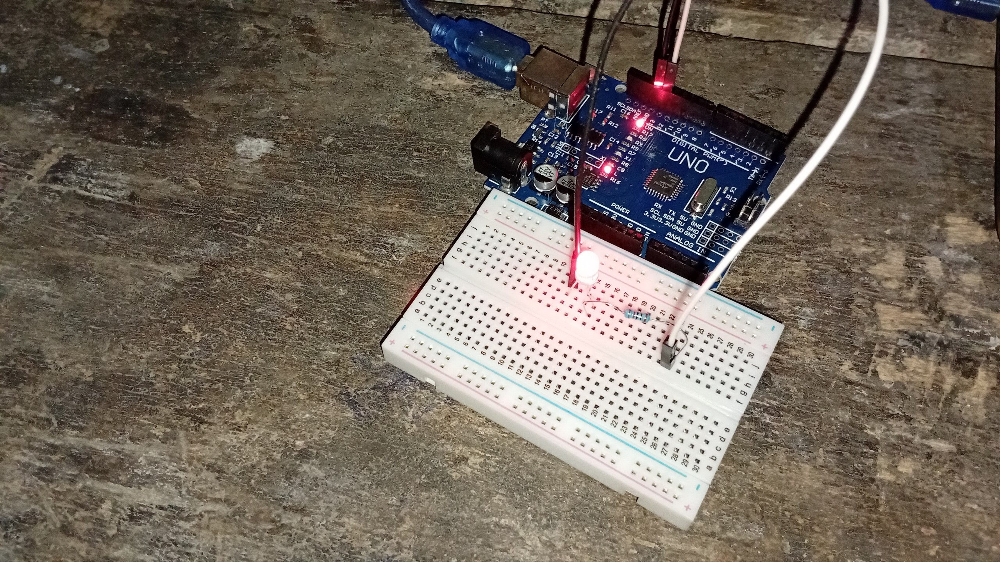
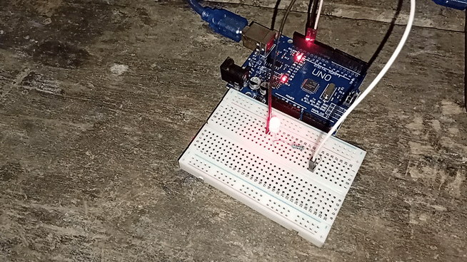

# ⚡ Projet Arduino - Clignotement de LED (Blink)

Premier projet d'initiation à la programmation d'une carte **Arduino UNO R3** : apprentissage du contrôle d'une sortie numérique pour faire clignoter une LED à un rythme défini.

---

## 📸 Aperçu et Démonstration

| Schéma électrique | Montage réel | Démonstration en direct |
| :---: | :---: | :---: |
|  |  |  |

---

## 🧰 Matériel utilisé

* **1x** Carte Arduino UNO R3 (avec câble USB)
* **1x** Breadboard (plaque d'essai)
* **1x** LED (couleur au choix)
* **1x** Résistance de 220 Ω (ou 330 Ω)
* **2x** Câbles de connexion DuPont (mâle-mâle)

---

## 🔌 Câblage et Montage

1. Connecter l'**Anode** (patte longue, `+`) de la LED à la **broche numérique 13** (`Pin 13`) de l'Arduino en passant par la résistance de **220 Ω**.
2. Connecter la **Cathode** (patte courte, `-`) de la LED à l'une des broches **GND** (Masse) de l'Arduino.

### Récapitulatif du circuit :
* **Pin 13** ➔ Résistance 220 Ω ➔ Anode (`+`) LED
* **GND** ➔ Cathode (`-`) LED

---

## 💻 Code Source

Le code source du projet est disponible dans le fichier [`blink.ino`](blink.ino).

---

## 🚀 Comment tester le projet ?

1. Connecter la carte Arduino UNO à l'ordinateur via le câble USB.
2. Ouvrir le logiciel **Arduino IDE**.
3. Sélectionner la carte **Arduino Uno** et le port COM approprié.
4. Téléverser le fichier `blink.ino` sur la carte.